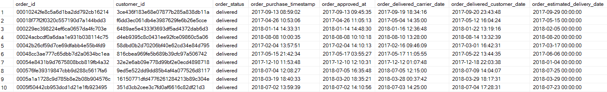
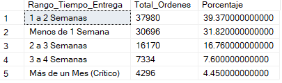

# Proyecto SQL: Optimización Operativa y Financiera en E-Commerce - Análisis Integrado de Logística, Ventas y Experiencia del cliente

## Descripción del Proyecto

### Contexto y Problemática
_Una empresa líder de e-commerce con alto volumen de ventas presenta una fragmentación en sus datos (silos de información) entre las áreas de Operaciones, Finanzas y Servicio al Cliente. Actualmente, la gerencia carece de visibilidad integrada, impidiéndole medir el impacto directo de los retrasos logísticos en la satisfacción del cliente y cuantificar el riesgo financiero que estos retrasos representan para la retención de sus clientes VIP y Preferente_

### Objetivo
_Utilizar SQL dentro de SQL Server Management Studio (SSMS) para procesar y consolidar los datos operativos, comerciales y de experiencia de usuario. El propósito es transformar estos datos crudos en insights clave que permitan proporcionar recomendaciones estratégicas para optimizar los procesos de distribución, mitigar la fuga de clientes de alto valor y maximizar la rentabilidad del negocio_

## Estructura del Proyecto

- [Sobre los Datos](#sobre-los-datos)
- [Tareas](#tareas)
- [Limpieza de Datos](#limpieza-de-datos)
- [Transformación de Datos](#transformación-de-datos)
- [Modelamiento de Datos](#modelamiento-de-datos)
- [Análisis Exploratorio de Datos e Insights](#análisis-exploratorio-de-datos-e-insights)

## Sobre los Datos

Los datos originales, junto con una explicación de cada columna, se pueden encontrar [aquí](https://www.kaggle.com/datasets/olistbr/brazilian-ecommerce?resource=download&select=olist_orders_dataset.csv).

El conjunto de datos incluye cinco tablas que abarcan información de las ordenes, productos,clientes, ventas y satisfacción del cliente,distribuidos en más de 99,000 registros y 36 columnas



## Tareas

En este análisis, ayudo a las áreas de Finanzas,Logística y Fidelización a responder lo siguiente:

1. **Volumen de ventas:**¿Cuál es el volumen total de ventas, el número de pedidos concretados y el ticket promedio global del negocio?
2. **Tiempo de entrega de ordenes:**¿Qué porcentaje del total de órdenes se entrega dentro de la primera, segunda, tercera o cuarta semana desde la compra?
3. **Productos e Ingresos:**¿Cuáles son los 5 productos individuales que generan la mayor cantidad de ingresos acumulados para el negocio, a qué categoría pertenecen y cuál es su porcentaje de participación sobre la venta total de la empresa?
4. **Reseña según tiempo de entrega:**¿Cómo se distribuye el puntaje de reseña promedio cuando un pedido se entrega a tiempo versus cuando se entrega retrasado con la fecha estimada?
5. **Ingresos y reseñas:**¿Cuál es el total de ingresos y el porcentaje del total general de ventas que provienen de pedidos con calificaciones bajas (scores de 1 y 2)?
6. **Ventas y categoria de tamaño:**¿Cuáles son los 3 productos que más se venden dentro de cada categoría de tamaño?´
7. **Clientes según gasto:**¿Quiénes son los 10 clientes de mayor valor dentro del segmento VIP (Cliente Vip) según su gasto acumulado, y cómo se posiciona el consumo individual de cada uno de ellos frente al gasto promedio y al gasto máximo histórico de su misma categoría?
8. **Reseñas en ordenes con retraso de entrega:**¿Cómo se listan consecutivamente las experiencias de entrega de los clientes que sufrieron los mayores tiempos de demora en la empresa, y cuál fue el puntaje de reseña asociado a estos pedidos críticos?
9. **Pedidos con mayor valor monetario:**¿Cuáles son los 10 pedidos específicos que registraron el mayor valor monetario de compra y qué puesto ocupan en facturación dentro de su respectivo ciclo de distribución?
10. **Impacto financiero:**¿Cuál es el impacto financiero real de los retrasos logísticos severos en la retención de nuestros clientes más valiosos, calculando cuántos clientes básicos,clientes Preferentes y Clientes Vip han experimentado entregas críticas (más de un mes) y qué volumen de ingresos totales está en riesgo de perderse por problemas operativos?

## Limpieza de Datos

Previamente de realizar el análisis, es importante asegurar que los datos esten limpios y no presenten duplicados.

#### Valores Nulos o Faltantes

Verifiqué la existencia de valores faltantes en los campos con clave primaria. No se encontraron valores nulos.

```sql
--Verificar valores faltantes en la tabla orders_dataset

SELECT COUNT(*) AS Valores_faltantes
FROM orders_dataset
WHERE order_id IS NULL 

--Verificar valores faltantes en la tabla orders_items_dataset

SELECT COUNT(*) AS Valores_faltantes
FROM orders_items_dataset
WHERE order_id IS NULL 

--Verificar valores faltantes en la tabla products_dataset

SELECT COUNT(*) AS Valores_faltantes
FROM products_dataset
WHERE product_id IS NULL 

--Verificar valores faltantes en la tabla customers_dataset

SELECT COUNT(*) AS Valores_faltantes
FROM customers_dataset
WHERE customer_id IS NULL 

--Verificar valores faltantes en la tabla order_reviews_dataset

SELECT COUNT(*) AS Valores_faltantes
FROM order_reviews_dataset
WHERE review_id  IS NULL 
```

Verifiqué también valores nulos en las fechas de entrega(`order_delivered_customer_date`), aprobación(`order_approved_at`) y entrega a socio logístico(`order_delivered_carrier_date`) en la tabla orders_dataset. Detectándose valores nulos por motivos de cancelacíon de pedidos u otras razones.

```sql
--Verificar valores nulos en las fechas de entrega, aprobación y entrega a socio logístico en la tabla orders_dataset
SELECT 
    COUNT(*) AS total_pedidos,
    SUM(CASE WHEN order_delivered_customer_date IS NULL THEN 1 ELSE 0 END) AS pedidos_sin_fecha_entrega,
    SUM(CASE WHEN order_approved_at IS NULL THEN 1 ELSE 0 END) AS pedidos_sin_fecha_aprobacion,
	SUM(CASE WHEN order_delivered_carrier_date IS NULL THEN 1 ELSE 0 END) AS pedidos_sin_fecha_entrega_logistico
FROM orders_dataset;
```

A continuación, es vital asegurarse de que no se presente filas duplicadas. En este caso no se encontraron filas duplicadas.

```sql
--Verificar valores duplicados en la tabla orders_dataset

SELECT order_id, count(*)
FROM orders_dataset
GROUP BY order_id
HAVING count(*) > 1

--Verificar valores duplicados en la tabla products_dataset

SELECT product_id, count(*)
FROM products_dataset
GROUP BY product_id
HAVING count(*) >1 

--Verificar valores duplicados en la tabla customers_dataset

SELECT customer_id, count(*)
FROM customers_dataset
GROUP BY customer_id
HAVING count(*) > 1
```
## Transformación de Datos

Transformé los datos de la tabla products_dataset para obtener la tabla dim_product, ya que necesito una tabla con la información del volumen de los productos y categoria del tamaño para futuras consultas

```sql
--Transformando la tabla de dimensiones producto de la tabla products_dataset

Select product_id, (product_length_cm * product_height_cm * product_width_cm) as volume_product,
       ( case 
	     when (product_length_cm * product_height_cm * product_width_cm) <= 5000 then 'Pequeño'
		 when (product_length_cm * product_height_cm * product_width_cm) <= 20000 then 'Mediano'
		 else 'Grande'
		 end ) as Categoria_tamaño
		 into dim_product
		from products_dataset

Select * from dim_product
```

También transformé los datos de la tabla customers_dataset cruzandolo usando JOINS con las tablas orders_dataset y orders_items_dataset, ya que necesitaba una tabla con el total gastado por cliente y la categoría de cliente según lo decidido a gastar.

```sql
--Transformando la tabla de comportamiento de clientes de la tabla customers_dataset

select c.customer_unique_id, sum(i.price) as Total_gastado,
       case
	   when sum(i.price) <200  THEN 'Cliente básico'
	   when sum(i.price) between 200 and 1000 THEN 'Cliente preferente'
	   else 'Cliente Vip'
	   end as Categoria
into dim_comportamiento_customer
from customers_dataset c
inner join  orders_dataset o on c.customer_id = o.customer_id
inner join  orders_items_dataset i on o.order_id=i.order_id
group by  c.customer_unique_id

select * from dim_comportamiento_customer
```

## Modelamiento de Datos

El diseño de la base de datos se estructuró bajo un enfoque analítico, organizando la información en un modelo relacional de hechos y dimensiones:

#### Tablas Hechos: 
orders_dataset y orders_items_dataset funcionan como el núcleo transaccional del modelo. Estas tablas registran el flujo operativo de los pedidos, los hitos logísticos clave (fechas) y la facturación (price).

#### Tablas Dimensiones:
customers_dataset, products_dataset y order_reviews_dataset aportan el contexto maestro de la operación. Adicionalmente, se incorporaron las dimensiones transformadas dim_comportamiento_customer y dim_product para facilitar la segmentación avanzada de clientes VIP y las categorías de tamaño del catálogo

Esta estructura relacional permite cruzar eficientemente variables operativas (fechas de entrega), financieras (precios) y de percepción (reseñas) a través de llaves primarias y foráneas (`order_id`, `product_id`, `customer_id`), asegurando la integridad de los datos en cada consulta analítica.


## Análisis Exploratorio de Datos e Insights

### Pregunta #1: ¿Cuál es el volumen total de ventas, el número de pedidos concretados y el ticket promedio global del negocio?


```sql
--Volumen total de ventas, número de pedidos concretados y ticket promedio global

WITH Resumen_Ventas_Reales AS (
    SELECT 
        SUM(oi.price) AS Ingreso_Total,
        COUNT(DISTINCT o.order_id) AS Total_Pedidos
    FROM orders_dataset o
    INNER JOIN orders_items_dataset oi 
        ON o.order_id = oi.order_id
    WHERE o.order_status = 'delivered' 
)
SELECT 
    Ingreso_Total,
    Total_Pedidos,
    ROUND((Ingreso_Total / Total_Pedidos),2) AS Ticket_Promedio
FROM Resumen_Ventas_Reales;
```


### Pregunta #2: ¿Qué porcentaje del total de órdenes se entrega dentro de la primera, segunda, tercera o cuarta semana desde la compra?

```sql
--Hallar porcentaje del total de ordenes de entrega

WITH Calculo_Rangos AS (
    SELECT 
        order_id,
        CASE 
            WHEN DATEDIFF(DAY, order_purchase_timestamp, order_delivered_customer_date) <= 7 THEN 'Menos de 1 Semana'
            WHEN DATEDIFF(DAY, order_purchase_timestamp, order_delivered_customer_date) <= 14 THEN '1 a 2 Semanas'
            WHEN DATEDIFF(DAY, order_purchase_timestamp, order_delivered_customer_date) <= 21 THEN '2 a 3 Semanas'
            WHEN DATEDIFF(DAY, order_purchase_timestamp, order_delivered_customer_date) <= 30 THEN '3 a 4 Semanas'
            ELSE 'Más de un Mes (Crítico)'
        END AS Rango_Tiempo_Entrega
    FROM orders_dataset  
    WHERE order_delivered_customer_date IS NOT NULL
      AND order_purchase_timestamp IS NOT NULL
)

SELECT 
    Rango_Tiempo_Entrega,
    COUNT(order_id) AS Total_Ordenes,
    ROUND(COUNT(order_id) * 100.0 / SUM(COUNT(order_id)) OVER(), 2) AS Porcentaje
FROM Calculo_Rangos
GROUP BY Rango_Tiempo_Entrega
ORDER BY Porcentaje DESC
```


