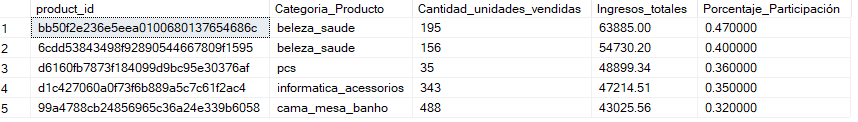
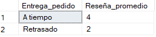

# Proyecto SQL: Análisis Integrado de Logística, Ventas y Experiencia del cliente en una empresa de E-commerce

## Descripción del Proyecto

### Contexto y Problemática
_Una empresa líder de e-commerce con alto volumen de ventas presenta una fragmentación en sus datos (silos de información) entre las áreas de Operaciones, Finanzas y Servicio al Cliente. Actualmente, la gerencia carece de visibilidad integrada, impidiéndole medir el impacto directo de los retrasos logísticos en la satisfacción del cliente y cuantificar el riesgo financiero que estos retrasos representan para la retención de sus clientes VIP y Preferente_

### Objetivo
_Utilizar SQL dentro de SQL Server Management Studio (SSMS) para procesar y consolidar los datos operativos, comerciales y de experiencia de usuario. El propósito es transformar estos datos crudos en insights clave que permitan proporcionar recomendaciones estratégicas para optimizar los procesos de distribución, mitigar la fuga de clientes de alto valor y maximizar la rentabilidad del negocio_

## Estructura del Proyecto

- [Sobre los Datos](#sobre-los-datos)
- [Tareas](#tareas)
- [Limpieza de Datos](#limpieza-de-datos)
- [Transformación de Datos](#transformación-de-datos)
- [Modelamiento de Datos](#modelamiento-de-datos)
- [Análisis Exploratorio de Datos e Insights](#análisis-exploratorio-de-datos-e-insights)

## Sobre los Datos

Los datos originales, junto con una explicación de cada columna, se pueden encontrar [aquí](https://www.kaggle.com/datasets/olistbr/brazilian-ecommerce?resource=download&select=olist_orders_dataset.csv). 

La base de datos original está compuesta por un ecosistema de 9 tablas, para este proyecto se seleccionó un subconjunto de 5 tablas clave, las cuales contienen la información esencial para el análisis de este proyecto.

El conjunto de datos integra un total de 36 columnas distribuidas en las siguientes cinco tablas:

- customers_dataset (Tabla de clientes)

- orders_dataset (Tabla de órdenes)

- order_items_dataset (Tabla de detalles del pedido)

- products_dataset (Tabla de productos)

- order_reviews_dataset (Tabla de reseñas)


_Tabla de órdenes_

## Tareas

En este análisis, ayudo a las áreas de Finanzas,Logística y Fidelización a responder lo siguiente:

1. **Volumen de ventas:**¿Cuál es el volumen total de ventas, el número de pedidos concretados y el ticket promedio global del negocio?
2. **Tiempo de entrega de ordenes:**¿Qué porcentaje del total de órdenes se entrega dentro de la primera, segunda, tercera o cuarta semana desde la compra?
3. **Productos e Ingresos:**¿Cuáles son los 5 productos individuales que generan la mayor cantidad de ingresos acumulados para el negocio, a qué categoría pertenecen y cuál es su porcentaje de participación sobre la venta total de la empresa?
4. **Reseña según tiempo de entrega:**¿Cómo se distribuye el puntaje de reseña promedio cuando un pedido se entrega a tiempo versus cuando se entrega retrasado con la fecha estimada?
5. **Ingresos y reseñas:**¿Cuál es el total de ingresos y el porcentaje del total general de ventas que provienen de pedidos con calificaciones bajas (scores de 1 y 2)?
6. **Ventas y categoria de tamaño:**¿Cuáles son los 3 productos que más se venden dentro de cada categoría de tamaño?´
7. **Clientes según gasto:**¿Quiénes son los 10 clientes de mayor valor dentro del segmento VIP (Cliente Vip) según su gasto acumulado, y cómo se posiciona el consumo individual de cada uno de ellos frente al gasto promedio y al gasto máximo histórico de su misma categoría?
8. **Reseñas en ordenes con retraso de entrega:**¿Cómo se listan consecutivamente las experiencias de entrega de los clientes que sufrieron los mayores tiempos de demora en la empresa, y cuál fue el puntaje de reseña asociado a estos pedidos críticos?
9. **Pedidos con mayor valor monetario:**¿Cuáles son los 10 pedidos específicos que registraron el mayor valor monetario de compra y qué puesto ocupan en facturación dentro de su respectivo ciclo de distribución?
10. **Impacto financiero:**¿Cuál es el impacto financiero real de los retrasos logísticos severos en la retención de nuestros clientes más valiosos, calculando cuántos clientes básicos,clientes Preferentes y Clientes Vip han experimentado entregas críticas (más de un mes) y qué volumen de ingresos totales está en riesgo de perderse por problemas operativos?

## Limpieza de Datos

Previamente de realizar el análisis, es importante asegurar que los datos esten limpios y no presenten duplicados.

#### Valores Nulos o Faltantes

Verifiqué la existencia de valores faltantes en los campos con clave primaria. No se encontraron valores nulos.

```sql
--Verificar valores faltantes en la tabla orders_dataset

SELECT COUNT(*) AS Valores_faltantes
FROM orders_dataset
WHERE order_id IS NULL 

--Verificar valores faltantes en la tabla orders_items_dataset

SELECT COUNT(*) AS Valores_faltantes
FROM orders_items_dataset
WHERE order_id IS NULL 

--Verificar valores faltantes en la tabla products_dataset

SELECT COUNT(*) AS Valores_faltantes
FROM products_dataset
WHERE product_id IS NULL 

--Verificar valores faltantes en la tabla customers_dataset

SELECT COUNT(*) AS Valores_faltantes
FROM customers_dataset
WHERE customer_id IS NULL 

--Verificar valores faltantes en la tabla order_reviews_dataset

SELECT COUNT(*) AS Valores_faltantes
FROM order_reviews_dataset
WHERE review_id  IS NULL 
```

Verifiqué también valores nulos en las fechas de entrega(`order_delivered_customer_date`), aprobación(`order_approved_at`) y entrega a socio logístico(`order_delivered_carrier_date`) en la tabla orders_dataset. Detectándose valores nulos por motivos de cancelacíon de pedidos u otras razones.

```sql
--Verificar valores nulos en las fechas de entrega, aprobación y entrega a socio logístico en la tabla orders_dataset
SELECT 
    COUNT(*) AS total_pedidos,
    SUM(CASE WHEN order_delivered_customer_date IS NULL THEN 1 ELSE 0 END) AS pedidos_sin_fecha_entrega,
    SUM(CASE WHEN order_approved_at IS NULL THEN 1 ELSE 0 END) AS pedidos_sin_fecha_aprobacion,
	SUM(CASE WHEN order_delivered_carrier_date IS NULL THEN 1 ELSE 0 END) AS pedidos_sin_fecha_entrega_logistico
FROM orders_dataset;
```

A continuación, es vital asegurarse de que no se presente filas duplicadas. En este caso no se encontraron filas duplicadas.

```sql
--Verificar valores duplicados en la tabla orders_dataset

SELECT order_id, count(*)
FROM orders_dataset
GROUP BY order_id
HAVING count(*) > 1

--Verificar valores duplicados en la tabla products_dataset

SELECT product_id, count(*)
FROM products_dataset
GROUP BY product_id
HAVING count(*) >1 

--Verificar valores duplicados en la tabla customers_dataset

SELECT customer_id, count(*)
FROM customers_dataset
GROUP BY customer_id
HAVING count(*) > 1
```
## Transformación de Datos

Transformé los datos de la tabla products_dataset para obtener la tabla dim_product, ya que necesito una tabla con la información del volumen de los productos y categoria del tamaño para futuras consultas

```sql
--Transformando la tabla de dimensiones producto de la tabla products_dataset

Select product_id, (product_length_cm * product_height_cm * product_width_cm) as volume_product,
       ( case 
	     when (product_length_cm * product_height_cm * product_width_cm) <= 5000 then 'Pequeño'
		 when (product_length_cm * product_height_cm * product_width_cm) <= 20000 then 'Mediano'
		 else 'Grande'
		 end ) as Categoria_tamaño
		 into dim_product
		from products_dataset

Select * from dim_product
```

También transformé los datos de la tabla customers_dataset cruzandolo usando JOINS con las tablas orders_dataset y orders_items_dataset, ya que necesitaba una tabla con el total gastado por cliente y la categoría de cliente según lo decidido a gastar.

```sql
--Transformando la tabla de comportamiento de clientes de la tabla customers_dataset

select c.customer_unique_id, sum(i.price) as Total_gastado,
       case
	   when sum(i.price) <200  THEN 'Cliente básico'
	   when sum(i.price) between 200 and 1000 THEN 'Cliente preferente'
	   else 'Cliente Vip'
	   end as Categoria
into dim_comportamiento_customer
from customers_dataset c
inner join  orders_dataset o on c.customer_id = o.customer_id
inner join  orders_items_dataset i on o.order_id=i.order_id
group by  c.customer_unique_id

select * from dim_comportamiento_customer
```

## Modelamiento de Datos

El diseño de la base de datos se estructuró bajo un enfoque analítico, organizando la información en un modelo relacional de hechos y dimensiones:

#### Tablas Hechos: 
orders_dataset y orders_items_dataset funcionan como el núcleo transaccional del modelo. Estas tablas registran el flujo operativo de los pedidos, los hitos logísticos clave (fechas) y la facturación (price).

#### Tablas Dimensiones:
customers_dataset, products_dataset y order_reviews_dataset aportan el contexto maestro de la operación. Adicionalmente, se incorporaron las dimensiones transformadas dim_comportamiento_customer y dim_product para facilitar la segmentación avanzada de clientes VIP y las categorías de tamaño del catálogo

Esta estructura relacional permite cruzar eficientemente variables operativas (fechas de entrega), financieras (precios) y de percepción (reseñas) a través de llaves primarias y foráneas (`order_id`, `product_id`, `customer_id`), asegurando la integridad de los datos en cada consulta analítica.


_Diagrama Entidad-Relacíon de e-commerce_

## Análisis Exploratorio de Datos e Insights

### Pregunta #1: ¿Cuál es el ingreso total, el número de pedidos concretados y el ticket promedio global del negocio?

Para responder a la consulta, estructuré el código usando una CTE (WITH) para mantenerlo limpio. Apliqué el filtro WHERE order_status = 'delivered', asegurando que el volumen de ventas y el ticket promedio se calculen solo sobre pedidos concretados, excluyendo cancelaciones. Además, utilicé COUNT(DISTINCT order_id) para garantizar el conteo exacto de pedidos únicos, evitando duplicados cuando un mismo pedido contiene varios artículos.

```sql
--Ingreso total, número de pedidos concretados y ticket promedio global

WITH Resumen_Ventas_Reales AS (
    SELECT 
        SUM(oi.price) AS Ingreso_Total,
        COUNT(DISTINCT o.order_id) AS Total_Pedidos
    FROM orders_dataset o
    INNER JOIN orders_items_dataset oi 
        ON o.order_id = oi.order_id
    WHERE o.order_status = 'delivered' 
)
SELECT 
    Ingreso_Total,
    Total_Pedidos,
    ROUND((Ingreso_Total / Total_Pedidos),2) AS Ticket_Promedio
FROM Resumen_Ventas_Reales;
```


_Tabla de Ingreso total, Total de pedidos y Ticket promedio_

El ingreso total es 13,221,498.11 unidades monetarias, el total de pedidos 96478 y el ticket promedio es 137.04 u.m.

### Pregunta #2: ¿Qué porcentaje del total de órdenes se entrega dentro de la primera, segunda, tercera o cuarta semana desde la compra?

Para este análisis, estructuré el código mediante una CTE (WITH) utilizando una condicional CASE WHEN junto con la función DATEDIFF. Esto me permitió calcular los días transcurridos entre la compra y la entrega, clasificando  cada orden dentro de un rango semanal de distribución. Luego, en la consulta principal, utilicé una función de ventana (SUM(...) OVER()) para calcular dinámicamente el porcentaje que representa cada rango sobre el total global.
```sql
--Hallar porcentaje del total de ordenes de entrega

WITH Calculo_Rangos AS (
    SELECT 
        order_id,
        CASE 
            WHEN DATEDIFF(DAY, order_purchase_timestamp, order_delivered_customer_date) <= 7 THEN 'Menos de 1 Semana'
            WHEN DATEDIFF(DAY, order_purchase_timestamp, order_delivered_customer_date) <= 14 THEN '1 a 2 Semanas'
            WHEN DATEDIFF(DAY, order_purchase_timestamp, order_delivered_customer_date) <= 21 THEN '2 a 3 Semanas'
            WHEN DATEDIFF(DAY, order_purchase_timestamp, order_delivered_customer_date) <= 30 THEN '3 a 4 Semanas'
            ELSE 'Más de un Mes (Crítico)'
        END AS Rango_Tiempo_Entrega
    FROM orders_dataset  
    WHERE order_delivered_customer_date IS NOT NULL
      AND order_purchase_timestamp IS NOT NULL
)

SELECT 
    Rango_Tiempo_Entrega,
    COUNT(order_id) AS Total_Ordenes,
    ROUND(COUNT(order_id) * 100.0 / SUM(COUNT(order_id)) OVER(), 2) AS Porcentaje
FROM Calculo_Rangos
GROUP BY Rango_Tiempo_Entrega
ORDER BY Porcentaje DESC
```


_Tabla de porcentaje de ordenes según tiempo de entrega_

Vemos que el mayor porcentaje del total de ordenes son las ordenes que llegan en un rango de 1 a 2 semanas (39.37%) siguiendole las que llegan en menos de una semana (31.86%) lo cual es un buen resultado. Sin embargo,existe un 4.45% de pedidos críticos que demoran más de un mes.

Se recomienda auditar la cadena de suministro, identificandose si el retraso se refiere a la dispersión geográfica, quiebres de stock en almacén o ineficiencias de las empresas de transporte.

### Pregunta #3: ¿Cuáles son los 5 productos individuales (product_id) que generan la mayor cantidad de ingresos acumulados para el negocio, a qué categoría pertenecen y cuál es su porcentaje de participación sobre la venta total de la empresa?

Utilicé una CTE combinada con la claúsula TOP 5 para los productos de mayor rendimiento financiero basados en el SUM(price). En la consulta principal utilicé una subconsulta en la división (SELECT SUM(price)...) para calcular de forma directa el peso porcentual de cada uno de estos 5 productos sobre la facturación global de la empresa, midiendo así su nivel de concentración en las ventas.

```sql
--Los 5 productos que generan mayor cantidad de ingresos

WITH Top5IDs AS (   
    SELECT TOP 5
        product_id,
        COUNT(product_id) AS Cantidad_unidades_vendidas,
        SUM(price) AS Ingresos_totales
    FROM orders_items_dataset
    GROUP BY product_id
    ORDER BY Ingresos_totales DESC
)
SELECT 
    p.product_id,
	p.product_category_name AS Categoria_Producto,
    t.Cantidad_unidades_vendidas,
    ROUND(t.Ingresos_totales, 2) AS Ingresos_totales,
    ROUND((t.Ingresos_totales / (SELECT SUM(price) FROM orders_items_dataset)) * 100, 2) AS Porcentaje_Participación
FROM Top5IDs t
INNER JOIN products_dataset p ON t.product_id = p.product_id
ORDER BY t.Ingresos_totales DESC;
```



_Tabla de productos que generan mayor cantidad de ingresos_

El análisis del Top 5 de productos con mayores ingresos acumulados revela un mercado altamente fragmentado. Ningún producto individual supera el 0.47% de participación sobre la venta total de la empresa. Esto demuestra que la estabilidad financiera del negocio no depende de "productos estrella" únicos, sino de un catálogo diversificado que genera volumen de manera distribuida.

Se debe priorizar el control de stock de los productos de alta rotación , asegurando un stock de seguridad óptimo para evitar quiebres de inventario que afecten el flujo de caja, dado su alto volumen de salida.


### Pregunta #4: ¿Cómo se distribuye el puntaje de reseña promedio cuando un pedido se entrega a tiempo versus cuando se entrega retrasado con la fecha estimada?

Se utilizó WITH (CTE) junto con la función DATEDIFF para clasificar los pedidos en 'A tiempo' o 'Retrasado' según su fecha estimada; posteriormente, mediante un INNER JOIN, se cruzaron estos datos con la tabla order_reviews_dataset para convertir el puntaje a entero (CONVERT) y calcular su promedio (AVG) agrupado por cada estado de entrega, permitiendo cuantificar la caída exacta en la calificación generada por los retrasos.

```sql
-- Reseña promedio según entrega de pedido ('A tiempo', 'Retrasado') 
WITH Entrega AS(
SELECT order_id,
       CASE
	   WHEN DATEDIFF(DAY,order_delivered_customer_date,order_estimated_delivery_date)>= 0 then 'A tiempo'
	   ELSE 'Retrasado'
	   END AS Entrega_pedido
FROM orders_dataset
)

SELECT
      e.Entrega_pedido,
	  AVG(CONVERT(INT,o.review_score)) AS Reseña_promedio
	  FROM order_reviews_dataset o 
	  INNER JOIN Entrega e 
	  ON e.order_id = o.order_id
	  GROUP BY e.Entrega_pedido
```



_Tabla de promedio de reseña según tiempo de entrega_

El análisis demuestra una penalización drástica en la satisfacción del cliente a causa de los retrasos logísticos.

### Pregunta #5: ¿Cuál es el total de ingresos y el porcentaje del total general de ventas que provienen de pedidos con calificaciones bajas (scores de 1 y 2 )?

Se utilizó tabla hecha con WITH CTE que consolida los datos con un INNER JOIN entre la tablas order_reviews_dataset y orders_items_dataset y filtrando los puntajes críticos, también se utilizó una subconsulta para obtener el total de ventas de la empresa y luego calcular peso porcentual (ROUND) para ver que proporción del dinero del negocio está en riesgo debido a una mala experiencia de compra.

```sql
--Total de ingresos y porcentaje de productos con calificaciones bajas
WITH Metricas AS (
    SELECT 
        SUM(o.price) AS Ingresos_Calificaciones_Bajas,
        (SELECT SUM(price) FROM orders_items_dataset) AS Total_Ventas_Global
    FROM order_reviews_dataset r
    INNER JOIN orders_items_dataset o ON r.order_id = o.order_id
    WHERE r.review_score IN (1, 2)
)

SELECT 
    Ingresos_Calificaciones_Bajas,
    ROUND((Ingresos_Calificaciones_Bajas / Total_Ventas_Global) * 100, 2) AS Porcentaje_Del_Total_Global
FROM Metricas;
```


_Tabla de Ingresos de pedidos con calificaciones bajas_

Los ingreso de pedidos con reseñas bajas muestran un preocupante 16.64% de los ingresos totales de la empresa (equivalente a más de 2.26 millones).

Se recomienda analizar la causa raíz para identificar si el problema es logístico o de calidad del proveedor.

### Pregunta #6: ¿Cuáles son los 3 productos que más se venden dentro de cada categoría de tamaño?

Se utilizó WITH CTE donde se  unieron las tablas de dim_product y orders_items_dataset para sumar la facturación por artículo; luego, se aplicó la función de ventana RANK() particionada por el tamaño del producto para clasificar el rendimiento financiero de forma independiente dentro de cada grupo, filtrando finalmente los resultados con un WHERE Puesto_Ranking <= 3 para extraer únicamente los elementos top de cada segmento.

```sql
--Top 3 productos mas vendidos dentro de cateogria tamaños

WITH Ventas_por_producto AS(
SELECT p.Categoria_tamaño,
       p.product_id,
	   SUM(o.price) AS Ingresos_totales
FROM   dim_product p
INNER JOIN orders_items_dataset o
ON p.product_id = o.product_id
GROUP BY p.Categoria_tamaño,p.product_id
)

,Ranking_Productos AS(
SELECT Categoria_tamaño,
       product_id,
       Ingresos_totales,
	   RANK() OVER (
	   PARTITION BY Categoria_tamaño 
	   ORDER BY Ingresos_totales DESC
	   ) AS Puesto_Ranking
FROM  Ventas_por_producto 
)

SELECT  *  FROM Ranking_Productos
WHERE Puesto_Ranking <= 3
```


_Tabla de productos que más se venden según categoría de tamaño_

El ranking muestra que los productos de tamaño Pequeño y Mediano lideran la recaudación del negocio, destacando un artículo pequeño con el mayor ingreso individual (63,885.00). Además, el segmento Mediano muestra un rendimiento sumamente competitivo y equilibrado, ya que sus tres primeros puestos superan individualmente los 47,000 en facturación. En contraste, la categoría Grande registra los ingresos más bajos en su Top 3, evidenciando que los productos de menores dimensiones son los principales motores financieros de la plataforma.

Desde una perspectiva logística y comercial, se recomienda optimizar los espacios de almacenamiento priorizando el stock de alta rotación para productos pequeños y medianos, ya que maximizan la rentabilidad por metro cúbico.

### Pregunta #7: ¿Quiénes son los 10 clientes de mayor valor dentro del segmento VIP (Cliente Vip) según su gasto acumulado, y cómo se posiciona el consumo individual de cada uno de ellos frente al gasto promedio y al gasto máximo histórico de su misma categoría?

Se utilizaron las funciones de ventana AVG() y MAX() combinadas con la cláusula OVER (PARTITION BY Categoria), lo que permitió calcular dinámicamente el gasto promedio y el gasto máximo histórico de la categoría VIP.

```sql
-- 10 clientes de mayor valor según su gasto acumulado

SELECT TOP 10 
   customer_unique_id AS ID_cliente,
   Categoria,
   Round(Total_gastado,2) AS Gasto_Cliente,
   ROUND(AVG(Total_gastado) OVER (PARTITION BY Categoria),2) AS Gasto_Promedio,
   ROUND(MAX(Total_gastado) OVER (PARTITION BY Categoria),2) AS Gasto_Maximo
   FROM dim_comportamiento_customer
   WHERE Categoria = 'Cliente Vip'
   ORDER BY Total_gastado DESC
```


_Tabla de clientes Vip con mayor gasto acumulado_

El análisis revela una alta concentración de valor en el Top 10 de clientes VIP, cuyo consumo supera drásticamente el comportamiento del resto de su segmento. Mientras que el gasto promedio de la categoría VIP es de 1,627.59, el cliente del décimo puesto gasta casi el triple (4,590.00). Destaca de manera excepcional el cliente del primer puesto, quien registra un consumo de 13,440.00, posicionándose como el máximo histórico absoluto de la empresa y superando en más de 8 veces el promedio VIP, lo que evidencia la existencia de compradores altamente leales y rentables para el negocio

### Pregunta #8: ¿Cómo se listan consecutivamente las experiencias de entrega de los clientes que sufrieron los mayores tiempos de demora en la empresa, y cuál fue el puntaje de reseña (review_score) asociado a estos pedidos críticos?

Se usó la función de ventana ROW NUMBER() OVER(PARTITION BY ....) para enumerar y ordenar de forma consecutiva cada una de las experiencias de entrega de los clientes, agrupandolas de forma independiente por su puntaje de reseña y ordenándolas de mayor a menor según los días de retraso calculados con DATEDIFF.

```sql
--Ordenes que sufrieron mayores tiempos de demora
WITH Calculo_Retraso_Reseñas AS (
    SELECT 
        r.order_id AS ID_Pedido,
        r.review_score AS Puntaje_Reseña,
        DATEDIFF(DAY, 
            (SELECT o.order_estimated_delivery_date FROM orders_dataset o WHERE o.order_id = r.order_id), 
            (SELECT o.order_delivered_customer_date FROM orders_dataset o WHERE o.order_id = r.order_id)
        ) AS Dias_retraso,
        ROW_NUMBER() OVER( 
            PARTITION BY r.review_score 
            ORDER BY DATEDIFF
		        (DAY, 
                (SELECT o.order_estimated_delivery_date FROM orders_dataset o WHERE o.order_id = r.order_id), 
                (SELECT o.order_delivered_customer_date FROM orders_dataset o WHERE o.order_id = r.order_id)
            ) DESC
        ) AS Experiencia_Secuencial
    FROM order_reviews_dataset r
    WHERE r.review_score IN (1, 2)
) 

SELECT TOP 10
    ID_Pedido,
    Puntaje_Reseña,
    CASE 
        WHEN Dias_retraso > 0 THEN Dias_retraso 
        ELSE 0 
    END AS Dias_Retraso_Real,
    Experiencia_Secuencial
FROM Calculo_Retraso_Reseñas
ORDER BY 
      Dias_retraso DESC
```


_Tabla de pedidos con más dias de retraso en el tiempo de entrega_

Se visualizan retrasos entre 112 y 188 dias. A nivel del comportamiento del cliente lal mayoria de estos pedidos terminaron en calificaciones de 1 estrella, confirmando que las demoras severas perjudican la experiencia de compra y conducen al rechazo total de la marca o producto por parte del cliente.

Se recomienda urgentemente realizar auditorias por empresa de transporte y región geográfica para identificar que socios logísticos o rutas provocaron estos retrasos.

### Pregunta #9: ¿Cuáles son los 10 pedidos específicos que registraron el mayor valor monetario de compra y qué puesto ocupan en facturación dentro de su respectivo ciclo de distribución?

Primero consolidé el valor total por orden y clasifiqué los tiempos de entrega en rangos semanales mediante DATEDIFF; luego puse la función de ventana RANK() OVER (PARTITION BY Rango_tiempo_entrega ORDER BY Valor_Total_Pedido DESC), la cual fue clave para generar rankings financieros independientes y dinámicos dentro de cada grupo de tiempo sin mezclar los datos, extrayendo finalmente el Top 10 de mayor facturación.

```sql
--Los 10 pedidos que registraron mayor valor monetario y puesto, rango de tiempo de entrega y ranking 
WITH Monto_Consolidado_Pedido AS (
    
    SELECT 
        order_id,
        SUM(price) AS Valor_Total_Pedido
    FROM orders_items_dataset
    GROUP BY order_id
),

Clasificacion_tiempo_entrega AS(
SELECT m.order_id,
       m.Valor_Total_Pedido,
	    CASE 
            WHEN DATEDIFF(DAY, order_purchase_timestamp, order_delivered_customer_date) <= 7 THEN 'Menos de 1 Semana'
            WHEN DATEDIFF(DAY, order_purchase_timestamp, order_delivered_customer_date) <= 14 THEN '1 a 2 Semanas'
            WHEN DATEDIFF(DAY, order_purchase_timestamp, order_delivered_customer_date) <= 21 THEN '2 a 3 Semanas'
            WHEN DATEDIFF(DAY, order_purchase_timestamp, order_delivered_customer_date) <= 30 THEN '3 a 4 Semanas'
            ELSE 'Más de un Mes (Crítico)'
		END AS Rango_tiempo_entrega
FROM orders_dataset o
INNER JOIN  Monto_Consolidado_Pedido m
ON o.order_id = m.order_id
WHERE o.order_delivered_customer_date IS NOT NULL
      AND o.order_purchase_timestamp IS NOT NULL
)

SELECT TOP 10 
	    order_id as ID_pedido,
		Rango_tiempo_entrega,
		Valor_Total_Pedido as Monto,
		RANK() OVER(
		     PARTITION BY Rango_tiempo_entrega
			 ORDER BY Valor_Total_Pedido DESC
			 ) AS Ranking_Monto
FROM Clasificacion_tiempo_entrega
```


_Tabla de los 10 pedidos con mayor valor monetario_

Podemos ver que todos los pedidos con mayor valor monetario se concentran en el rango de entrega de 1 a 2 semanas. Esto indica que el flujo logístico actual responde con eficiencia  ante transacciones de gran volumen financiero.

Se recomienda aplicar estrategias para cualquier pedido que supere un valor alto para que así estas ordenes sean priorizados en el proceso de distribución para asegurar que sigan cumpliendo consistentemente este ciclo de 1 a 2 semanas o incluso reducirlo a menos de una semana.


### Pregunta #10: ¿Cuál es el impacto financiero real de los retrasos logísticos severos en la retención de nuestros clientes más valiosos, calculando cuántos clientes básicos,clientes Preferentes y Clientes Vip han experimentado entregas críticas (más de un mes) y qué volumen de ingresos totales está en riesgo de perderse por problemas operativos?

En esta consulta final, mi objetivo fue medir el impacto financiero real que tienen los retrasos logísticos severos en la retención de nuestros clientes según su nivel de valor (Básicos, Preferentes y VIP). Primero, utilicé expresiones de tabla comunes (WITH CTEs) y la función DATEDIFF para aislar los pedidos con entregas críticas de más de 30 días, vinculándolos con la identidad única de cada usuario mediante INNER JOIN. Luego  la combinación de agrupaciones por segmento y el uso de la función de ventana SUM(Total_en_riesgo) OVER(), la cual me permitió calcular en paralelo la facturación total en peligro y obtener el peso porcentual del impacto operativo sobre cada categoría de cliente, ordenando los resultados para visibilizar qué segmento concentra el mayor riesgo financiero para la empresa.

```sql
--Impacto en retrasos logisticos segun segmentación de cliente

WITH Pedidos_criticos AS(
SELECT 
     o.customer_id,
	 o.order_id
	 FROM orders_dataset o
	 WHERE DATEDIFF(DAY,o.order_purchase_timestamp,o.order_delivered_customer_date) > 30
),

Clientes_Unificados AS (
    
    SELECT 
        c.customer_unique_id,
        pc.order_id
    FROM Pedidos_criticos pc
    INNER JOIN customers_dataset c ON pc.customer_id = c.customer_id
),

Clientes_en_riesgo AS(
SELECT 
     dim.Categoria as Segmento_cliente,
	 COUNT(DISTINCT cu.customer_unique_id) AS Cantidad_clientes_afectados,
	 SUM(dim.Total_gastado) as Total_en_riesgo
	 FROM Clientes_Unificados cu
	 INNER JOIN dim_comportamiento_customer dim
	 ON cu.customer_unique_id = dim.customer_unique_id
	 GROUP BY dim.Categoria
)

SELECT 
    Segmento_cliente,
    Cantidad_clientes_afectados,
    ROUND(Total_en_riesgo, 2) AS Facturacion_En_Riesgo,
    ROUND((Total_en_riesgo / SUM(Total_en_riesgo) OVER()) * 100, 2) AS Porcentaje_Impacto_Riesgo
FROM Clientes_en_riesgo
ORDER BY Total_en_riesgo DESC;
```


_Tabla de ingresos en riesgo por segmento de cliente_

Se visualiza que el grupo más afectado es el de Clientes Preferentes, concentrando 46.28% dle riesgo total  con 888 usuarios afectados y una facturación comprometida de 347,955.79 . En segundo lugar, el segmento de Clientes Básicos registra la mayor cantidad de personas afectadas (3,313 clientes) representando el 39.67% del impacto. Finalmente, aunque los Clientes VIP muestran el menor porcentaje global (14.05%), la pérdida potencial sigue siendo alarmante debido a su alto valor individual, acumulando 105,625.00 en riesgo con apenas 68 clientes afectados.

Se recomienda rediseñar la prioridad de procesamiento de pedidos en almacén. Las ordenes de clientes Preferentes y Vip deben ser priorizados en el sistema de distribución para asegurar que sus entregas se mantengan en el rango de tiempo de entrega estimado para así aumentar la recurrencia de compra de los clientes con mayor valor de compra.

### Conclusión

- a

- b


